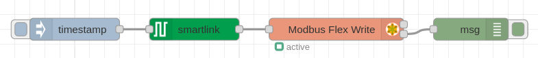

# node-red-contrib-schneider-powerlogic
A Node-RED nodes to read Schneider PowerLogic series over Modbus TCP/IP.
## Node-RED configurator to read Schneider PowerLogic series over Modbus TCP/IP through Ethernet gateway

## Install
You can install these nodes directly from the "Manage Palette" menu in the Node-RED interface.

Alternatively, run the following command in your Node-RED user directory - typically `~/.node-red` on Linux or `%HOMEPATH%\.nodered` on Windows

        npm install node-red-contrib-schneider-powerlogic 

## How to use

### meter node 
Use the `pm3000`, `pm5000`, `iem3000`, `powertag` or `smartlink` node to configure which information you want to request from the gateway.

Wire the output of the `pm3000`, `pm5000`, `iem3000`, `powertag` or `smartlink` to the input of the `Modbus Flex Getter` from 'node-red-contrib-modbus' modules.

Enable check box `Keep Msg Properties` in the `Modbus Flex Getter` properties.

With `smartlink` node it's possible to send commands using `Modbus Flex Write` from 'node-red-contrib-modbus' modules.

### converter node
Use the `converter` node to prepare data for further use.

Wire the second output of the `Modbus Flex Getter` to the input of the `converter`.

## Usage
### Example flow

## Meters data
### PowerLogic series
List of **PM3000/PM5000** meter data:

| Measure                            | Units                 | Type          | 
| ---------------------------------- | --------------------- | ------------- | 
|  I1: phase 1 current               | A                     | Float32       | 
|  I2: phase 2 current               | A                     | Float32       |
|  I3: phase 3 current               | A                     | Float32       |
|  Current Avg                       | A                     | Float32       |
|  Voltage L1-L2                     | V                     | Float32       |
|  Voltage L2-L3                     | V                     | Float32       |
|  Voltage L3-L1                     | V                     | Float32       |
|  Voltage L-L Avg                   | V                     | Float32       |
|  Voltage L1-N                      | V                     | Float32       |
|  Voltage L2-N                      | V                     | Float32       |
|  Voltage L3-N                      | V                     | Float32       |
|  Voltage L-N Avg                   | V                     | Float32       |
|  Active power phase 1              | kW                    | Float32       |
|  Active power phase 2              | kW                    | Float32       |
|  Active power phase 3              | kW                    | Float32       |
|  Total active power                | kW                    | Float32       |
|  Reactive power phase 1            | kVAR                  | Float32       |
|  Reactive power phase 2            | kVAR                  | Float32       |
|  Reactive power phase 3            | kVAR                  | Float32       |
|  Total reactive power              | kVAR                  | Float32       |
|  Apparent power phase 1            | kVA                   | Float32       |
|  Apparent power phase 2            | kVA                   | Float32       |
|  Apparent power phase 3            | kVA                   | Float32       |
|  Total apparent power              | kVA                   | Float32       |
|  Power factor phase 1              | -                     | Float32       |
|  Power factor phase 2              | -                     | Float32       |
|  Power factor phase 3              | -                     | Float32       |
|  Power factor total                | -                     | Float32       |
|  Load type (capacitive, inductive) | -                     | String        |
|  Current unbalance I1              | %                     | Float32       |
|  Current unbalance I2              | %                     | Float32       |
|  Current unbalance I3              | %                     | Float32       |
|  Current unbalance worst           | %                     | Float32       |
|  Voltage unbalance L1-L2           | %                     | Float32       |
|  Voltage unbalance L2-L3           | %                     | Float32       |
|  Voltage unbalance L3-L1           | %                     | Float32       |
|  Voltage unbalance L-L Worst       | %                     | Float32       |
|  Voltage unbalance L1-N            | %                     | Float32       |
|  Voltage unbalance L2-N            | %                     | Float32       |
|  Voltage unbalance L3-N            | %                     | Float32       |
|  Voltage unbalance L-N worst       | %                     | Float32       |
|  Tangent phi total                 | -                     | Float32       |
|  Frequency                         | Hz                    | Float32       |
|  Temperature                       | °C                    | Float32       |
|  Total active energy import        | Wh                    | Int64         |
|  Total active energy export        | Wh                    | Int64         |
|  Total reactive energy import      | VARh                  | Int64         |
|  Total reactive energy export      | VARh                  | Int64         |
|  Total apparent energy import      | VAh                   | Int64         |
|  Total apparent energy export      | VAh                   | Int64         |
|  Partial active energy import      | Wh                    | Int64         |
|  Partial reactive energy import    | VARh                  | Int64         |
|  Partial apparent energy import    | VAh                   | Int64         |
|  Active energy import phase 1      | Wh                    | Int64         |
|  Active energy import phase 2      | Wh                    | Int64         |
|  Active energy import phase 3      | Wh                    | Int64         |
|  Reactive energy import phase 1    | VARh                  | Int64         |
|  Reactive energy import phase 2    | VARh                  | Int64         |
|  Reactive energy import phase 3    | VARh                  | Int64         |
|  Apparent energy import phase 1    | VAh                   | Int64         |
|  Apparent energy import phase 2    | VAh                   | Int64         |
|  Apparent energy import phase 3    | VAh                   | Int64         |
|  Rate 1 active energy import       | Wh                    | Int64         |
|  Rate 2 active energy import       | Wh                    | Int64         |
|  Rate 3 active energy import       | Wh                    | Int64         |
|  Rate 4 active energy import       | Wh                    | Int64         |

List of **iEM3000** meter data:

| Measure                            | Units                 | Type          | 
| ---------------------------------- | --------------------- | ------------- | 
|  I1: phase 1 current               | A                     | Float32       | 
|  I2: phase 2 current               | A                     | Float32       |
|  I3: phase 3 current               | A                     | Float32       |
|  Current Avg                       | A                     | Float32       |
|  Voltage L1-L2                     | V                     | Float32       |
|  Voltage L2-L3                     | V                     | Float32       |
|  Voltage L3-L1                     | V                     | Float32       |
|  Voltage L-L Avg                   | V                     | Float32       |
|  Voltage L1-N                      | V                     | Float32       |
|  Voltage L2-N                      | V                     | Float32       |
|  Voltage L3-N                      | V                     | Float32       |
|  Voltage L-N Avg                   | V                     | Float32       |
|  Active power phase 1              | kW                    | Float32       |
|  Active power phase 2              | kW                    | Float32       |
|  Active power phase 3              | kW                    | Float32       |
|  Total active power                | kW                    | Float32       |
|  Power factor total                | -                     | Float32       |
|  Frequency                         | Hz                    | Float32       |
|  Total active energy import        | Wh                    | Int64         |

### PowerTag Energy Sensors

**PowerTag Energy x63** (A9MEM152x, A9MEM154x, A9MEM156x, and A9MEM157x)

| Measure                                            | Units                 | Type          | 
| -------------------------------------------------- | --------------------- | ------------- | 
|  RMS current on phase A                            | A                     | Float32       | 
|  RMS current on phase B                            | A                     | Float32       |
|  RMS current on phase C                            | A                     | Float32       |
|  RMS phase-to-phase voltage A-B                    | V                     | Float32       |
|  RMS phase-to-phase voltage B-C                    | V                     | Float32       |
|  RMS phase-to-neutral voltage A-N                  | V                     | Float32       |
|  RMS phase-to-neutral voltage B-N                  | V                     | Float32       |
|  RMS phase-to-neutral voltage C-N                  | V                     | Float32       |
|  Active power phase A                              | W                     | Float32       |
|  Active power phase B                              | W                     | Float32       |
|  Active power phase C                              | W                     | Float32       |
|  Total active power                                | W                     | Float32       |
|  Total apparent power                              | VA                    | Float32       |
|  Total power factor                                |                       | Float32       |
|  Total active energy delivered + received          | Wh                    | Int64         |
|  Partial active energy delivered + received        | Wh                    | Int64         |
|  Damand total active power                         | Wh                    | Float32       |
|  Maximum demand total active power                 | Wh                    | Float32       |

**PowerTag Energy M250/M630** (LV43402x)

| Measure                                            | Units                 | Type          | 
| -------------------------------------------------- | --------------------- | ------------- | 
|  RMS current on phase A                            | A                     | Float32       | 
|  RMS current on phase B                            | A                     | Float32       |
|  RMS current on phase C                            | A                     | Float32       |
|  RMS phase-to-phase voltage A-B                    | V                     | Float32       |
|  RMS phase-to-phase voltage B-C                    | V                     | Float32       |
|  RMS phase-to-neutral voltage A-N                  | V                     | Float32       |
|  RMS phase-to-neutral voltage B-N                  | V                     | Float32       |
|  RMS phase-to-neutral voltage C-N                  | V                     | Float32       |
|  Active power phase A                              | W                     | Float32       |
|  Active power phase B                              | W                     | Float32       |
|  Active power phase C                              | W                     | Float32       |
|  Total active power                                | W                     | Float32       |
|  Total reactive power                              | VAR                   | Float32       |
|  Total apparent power                              | VA                    | Float32       |
|  Total power factor                                |                       | Float32       |
|  Frequency                                         | Hz                    | Float32       |
|  Device temperature                                | °C                    | Float32       |
|  Total active energy delivered count positively    | Wh                    | Int64         |
|  Total active energy received                      | Wh                    | Int64         |
|  Active energy phase A delivered                   | Wh                    | Int64         |
|  Active energy phase B delivered                   | Wh                    | Int64         |
|  Active energy phase C delivered                   | Wh                    | Int64         |
|  Partial active energy delivered                   | Wh                    | Int64         |
|  Partial active energy receivede                   | Wh                    | Int64         |
|  Partial reactive energy delivered                 | VARh                  | Int64         |
|  Partial reactive energy received                  | VARh                  | Int64         |

**PowerTag Energy F160 and Rope** (LV43402x)

| Measure                                            | Units                 | Type          | 
| -------------------------------------------------- | --------------------- | ------------- | 
|  RMS current on phase A                            | A                     | Float32       | 
|  RMS current on phase B                            | A                     | Float32       |
|  RMS current on phase C                            | A                     | Float32       |
|  RMS current on neutral                            | A                     | Float32       |
|  RMS phase-to-phase voltage A-B                    | V                     | Float32       |
|  RMS phase-to-phase voltage B-C                    | V                     | Float32       |
|  RMS phase-to-neutral voltage A-N                  | V                     | Float32       |
|  RMS phase-to-neutral voltage B-N                  | V                     | Float32       |
|  RMS phase-to-neutral voltage C-N                  | V                     | Float32       |
|  Active power phase A                              | W                     | Float32       |
|  Active power phase B                              | W                     | Float32       |
|  Active power phase C                              | W                     | Float32       |
|  Total active power                                | W                     | Float32       |
|  Reactive power phase A                            | VAR                   | Float32       |
|  Reactive power phase B                            | VAR                   | Float32       |
|  Reactive power phase C                            | VAR                   | Float32       |
|  Total reactive power                              | VAR                   | Float32       |
|  Apparent power phase A                            | VA                    | Float32       |
|  Apparent power phase B                            | VA                    | Float32       |
|  Apparent power phase C                            | VA                    | Float32       |
|  Total apparent power                              | VA                    | Float32       |
|  Power factor phase A                              |                       | Float32       |
|  Power factor phase B                              |                       | Float32       |
|  Power factor phase C                              |                       | Float32       |
|  Total power factor                                |                       | Float32       |
|  Power factor sign convention   0 = IEC; 1 = IEE   |                       | Int16         |
|  Frequency                                         | Hz                    | Float32       |
|  Device temperature                                | °C                    | Float32       |
|  Total active energy delivered count positively    | Wh                    | Int64         |
|  Total active energy received                      | Wh                    | Int64         |
|  Partial active energy receivede                   | Wh                    | Int64         |
|  Partial reactive energy delivered                 | VARh                  | Int64         |
|  Partial reactive energy received                  | VARh                  | Int64         |
|  Damand total active power                         | Wh                    | Float32       |
|  Maximum demand total active power                 | Wh                    | Float32       |

### Acti9 Smartlink

**iOF+SD24**

| Status                                             | Units                 | Type          | 
| -------------------------------------------------- | --------------------- | ------------- | 
|  OF status                                         |                       | Bitmap        | 
|  SD status                                         |                       | Bitmap        |

| Counters                                           | Units                 | Type          | 
| -------------------------------------------------- | --------------------- | ------------- | 
|  Number of circuit breaker opening/closing cycle   |                       | Uint32        | 
|  Number of trippings                               |                       | Uint32        |
|  Load operating time                               | Hours                 | Uint32        |

**OF+SD24**

| Status                                             | Units                 | Type          | 
| -------------------------------------------------- | --------------------- | ------------- | 
|  OF status                                         |                       | Bitmap        | 
|  SD status                                         |                       | Bitmap        |

| Counters                                           | Units                 | Type          | 
| -------------------------------------------------- | --------------------- | ------------- | 
|  Number of circuit breaker opening/closing cycle   |                       | Uint32        | 
|  Number of trippings                               |                       | Uint32        |
|  Load operating time                               | Hours                 | Uint32        |

**iACT24 Auxiliary for iCT Contactor**

| Status                                             | Units                 | Type          | 
| -------------------------------------------------- | --------------------- | ------------- | 
|  O/C contactor status                              |                       | Bitmap        | 
|  Device present                                    |                       | Bitmap        |

| Counters                                           | Units                 | Type          | 
| -------------------------------------------------- | --------------------- | ------------- | 
|  Number of contactor opening/closing cycle         |                       | Uint32        | 
|  Load operating time for an NO contactor           | Hours                 | Uint32        |

| Orders                                             | Units                 | Type          | 
| -------------------------------------------------- | --------------------- | ------------- | 
|  Deactive contactor coil                           |                       | Bitmap        |
|  Active contactor coil                             |                       | Bitmap        |

**iATL24 Auxiliary for iTL Impulse Relay**

| Status                                             | Units                 | Type          | 
| -------------------------------------------------- | --------------------- | ------------- | 
|  O/C contactor status                              |                       | Bitmap        | 
|  Device present                                    |                       | Bitmap        |

| Counters                                           | Units                 | Type          | 
| -------------------------------------------------- | --------------------- | ------------- | 
|  Number of impulse relay opening/close cycles      |                       | Uint32        | 
|  Load operating time                               | Hours                 | Uint32        |

| Orders                                             | Units                 | Type          | 
| -------------------------------------------------- | --------------------- | ------------- | 
|  Impulse relay contact opening                     |                       | Bitmap        |
|  Impulse relay contact closing                     |                       | Bitmap        |

**Acti9 RCA iC60 Remote Control with Ti24 Interface**

| Status                                             | Units                 | Type          | 
| -------------------------------------------------- | --------------------- | ------------- | 
|  OF status                                         |                       | Bitmap        |  
|  SD status                                         |                       | Bitmap        |

| Counters                                           | Units                 | Type          | 
| -------------------------------------------------- | --------------------- | ------------- | 
|  Number of circuit breaker opening/closing cycle   |                       | Uint32        | 
|  Number of trippings                               |                       | Uint32        |
|  Load operating time                               | Hours                 | Uint32        |

| Orders                                             | Units                 | Type          | 
| -------------------------------------------------- | --------------------- | ------------- | 
|  Activation of the open order                      |                       | Bitmap        |
|  Activation of the close order                     |                       | Bitmap        |

**Acti9 Reflex iC60 Integrated Control Circuit Breaker with Ti24 Interface**

| Status                                             | Units                 | Type          | 
| -------------------------------------------------- | --------------------- | ------------- | 
|  O/C status                                        |                       | Bitmap        |  
|  auto/OFF status                                   |                       | Bitmap        |

| Counters                                           | Units                 | Type          | 
| -------------------------------------------------- | --------------------- | ------------- | 
|  Number of circuit breaker opening/closing cycle   |                       | Uint32        | 
|  Number of trippings                               |                       | Uint32        |
|  Load operating time                               | Hours                 | Uint32        |

| Orders                                             | Units                 | Type          | 
| -------------------------------------------------- | --------------------- | ------------- | 
|  Activation of the open order                      |                       | Bitmap        |
|  Activation of the close order                     |                       | Bitmap        |

### Meter data 

### Order data 

### Sample Measure flow

### Sample Order flow

## Equipment compatibility

These modules has been developed and tested on:
+ PowerLogic PM3250
+ PowerLogic PM5100
+ PowerLogic PM5100
+ Acti9 PowerTag Link
+ Acti9 Smartlink
+ Ethernet Gateway Link150
