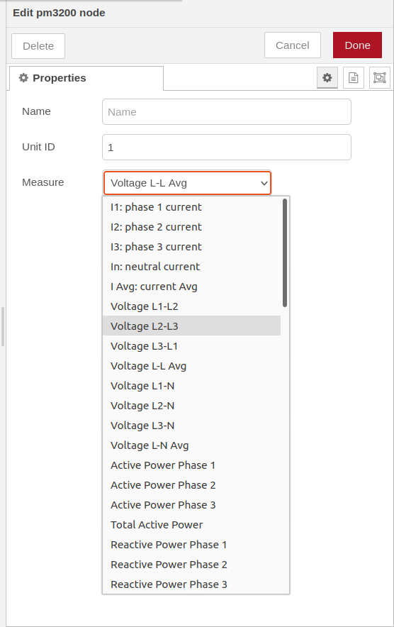
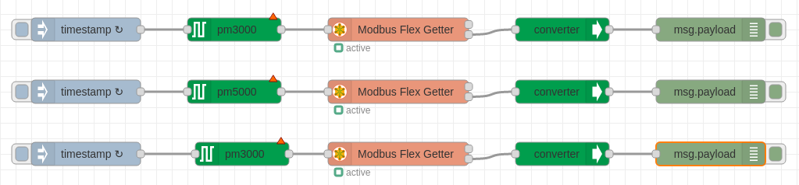

# node-red-contrib-schneider-powerlogic
A Node-RED nodes to read Schneider PowerLogic series over Modbus TCP/IP.
## Node-RED configurator to read Schneider PowerLogic series over Modbus TCP/IP through Ethernet gateway

## Install
You can install these nodes directly from the "Manage Palette" menu in the Node-RED interface.

Alternatively, run the following command in your Node-RED user directory - typically `~/.node-red` on Linux or `%HOMEPATH%\.nodered` on Windows

        npm install node-red-contrib-schneider-powerlogic 

## How to use

### meter node
Use the `pm3000`, `pm5000` or `iem3000` node to configure which information you want to request from the gateway.

Wire the output of the `pm3000`, `pm5000` or `iem3000` to the input of the `Modbus Flex Getter` from 'node-red-contrib-modbus' modules.

Enable check box `Keep Msg Properties` in the `Modbus Flex Getter` properties.

### converter node
Use the `converter` node to convert the values from the modbus response into human readable numbers.

Wire the second output of the `Modbus Flex Getter` to the input of the `converter`.

## Usage
List of **PM3000/PM5000** meter data:

| Measure                            | Units                 | Type          | 
| ---------------------------------- | --------------------- | ------------- | 
|  I1: phase 1 current               | A                     | Float32       | 
|  I2: phase 2 current               | A                     | Float32       |
|  I3: phase 3 current               | A                     | Float32       |
|  Current Avg                       | A                     | Float32       |
|  Voltage L1-L2                     | V                     | Float32       |
|  Voltage L2-L3                     | V                     | Float32       |
|  Voltage L3-L1                     | V                     | Float32       |
|  Voltage L-L Avg                   | V                     | Float32       |
|  Voltage L1-N                      | V                     | Float32       |
|  Voltage L2-N                      | V                     | Float32       |
|  Voltage L3-N                      | V                     | Float32       |
|  Voltage L-N Avg                   | V                     | Float32       |
|  Active power phase 1              | kW                    | Float32       |
|  Active power phase 2              | kW                    | Float32       |
|  Active power phase 3              | kW                    | Float32       |
|  Total active power                | kW                    | Float32       |
|  Reactive power phase 1            | kVAR                  | Float32       |
|  Reactive power phase 2            | kVAR                  | Float32       |
|  Reactive power phase 3            | kVAR                  | Float32       |
|  Total reactive power              | kVAR                  | Float32       |
|  Apparent power phase 1            | kVA                   | Float32       |
|  Apparent power phase 2            | kVA                   | Float32       |
|  Apparent power phase 3            | kVA                   | Float32       |
|  Total apparent power              | kVA                   | Float32       |
|  Power factor phase 1              | -                     | Float32       |
|  Power factor phase 2              | -                     | Float32       |
|  Power factor phase 3              | -                     | Float32       |
|  Power factor total                | -                     | Float32       |
|  Load type (capacitive, inductive) | -                     | String        |
|  Current unbalance I1              | %                     | Float32       |
|  Current unbalance I2              | %                     | Float32       |
|  Current unbalance I3              | %                     | Float32       |
|  Current unbalance worst           | %                     | Float32       |
|  Voltage unbalance L1-L2           | %                     | Float32       |
|  Voltage unbalance L2-L3           | %                     | Float32       |
|  Voltage unbalance L3-L1           | %                     | Float32       |
|  Voltage unbalance L-L Worst       | %                     | Float32       |
|  Voltage unbalance L1-N            | %                     | Float32       |
|  Voltage unbalance L2-N            | %                     | Float32       |
|  Voltage unbalance L3-N            | %                     | Float32       |
|  Voltage unbalance L-N worst       | %                     | Float32       |
|  Tangent phi total                 | -                     | Float32       |
|  Frequency                         | Hz                    | Float32       |
|  Temperature                       | °C                    | Float32       |
|  Total active energy import        | Wh                    | Int64         |
|  Total active energy export        | Wh                    | Int64         |
|  Total reactive energy import      | VARh                  | Int64         |
|  Total reactive energy export      | VARh                  | Int64         |
|  Total apparent energy import      | VAh                   | Int64         |
|  Total apparent energy export      | VAh                   | Int64         |

List of **iEM3000** meter data:

| Measure                            | Units                 | Type          | 
| ---------------------------------- | --------------------- | ------------- | 
|  I1: phase 1 current               | A                     | Float32       | 
|  I2: phase 2 current               | A                     | Float32       |
|  I3: phase 3 current               | A                     | Float32       |
|  Current Avg                       | A                     | Float32       |
|  Voltage L1-L2                     | V                     | Float32       |
|  Voltage L2-L3                     | V                     | Float32       |
|  Voltage L3-L1                     | V                     | Float32       |
|  Voltage L-L Avg                   | V                     | Float32       |
|  Voltage L1-N                      | V                     | Float32       |
|  Voltage L2-N                      | V                     | Float32       |
|  Voltage L3-N                      | V                     | Float32       |
|  Voltage L-N Avg                   | V                     | Float32       |
|  Active power phase 1              | kW                    | Float32       |
|  Active power phase 2              | kW                    | Float32       |
|  Active power phase 3              | kW                    | Float32       |
|  Total active power                | kW                    | Float32       |
|  Power factor total                | -                     | Float32       |
|  Frequency                         | Hz                    | Float32       |
|  Total active energy import        | Wh                    | Int64         |

### Meter data 

### Sample flow

## Equipment compatibility

These modules has been developed and tested on:
+ PowerLogic PM3250
+ PowerLogic PM5100
+ Ethernet Gateway Link150
