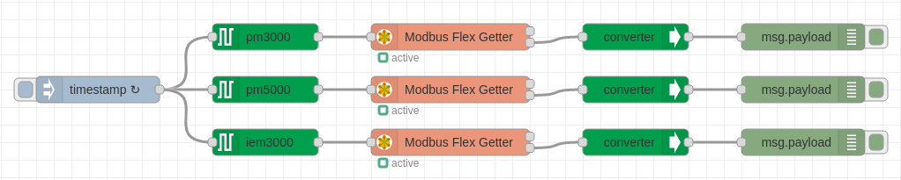

# node-red-contrib-schneider-powerlogic
A Node-RED nodes to read Schneider PowerLogic series over Modbus TCP/IP.
## Node-RED configurator to read Schneider PowerLogic series over Modbus TCP/IP through Ethernet gateway

## Install
You can install these nodes directly from the "Manage Palette" menu in the Node-RED interface.

Alternatively, run the following command in your Node-RED user directory - typically `~/.node-red` on Linux or `%HOMEPATH%\.nodered` on Windows

        npm install node-red-contrib-schneider-powerlogic 

## How to use

### meter node 
Use the `pm3000`, `pm5000`, `iem3000`, `powertag` or `smartlink` node to configure which information you want to request from the gateway.

Wire the output of the `pm3000`, `pm5000`, `iem3000`, `powertag` or `smartlink` to the input of the `Modbus Flex Getter` from 'node-red-contrib-modbus' modules.

Enable check box `Keep Msg Properties` in the `Modbus Flex Getter` properties.

With `smartlink` node it's possible to send commands using `Modbus Flex Write` from 'node-red-contrib-modbus' modules.

### converter node
Use the `converter` node to prepare data for further use.

Wire the second output of the `Modbus Flex Getter` to the input of the `converter`.

## Usage
### Example flow
```json
[{"id":"d2555447b94b0dcc","type":"tab","label":"Schneider PowerLogic ","disabled":false,"info":"","env":[]},{"id":"86ce2a3dedddd570","type":"debug","z":"d2555447b94b0dcc","name":"debug 1","active":true,"tosidebar":true,"console":false,"tostatus":false,"complete":"false","statusVal":"","statusType":"auto","x":1860,"y":320,"wires":[]},{"id":"2ea3581809c148b5","type":"modbus-flex-getter","z":"d2555447b94b0dcc","name":"","showStatusActivities":false,"showErrors":false,"logIOActivities":false,"server":"91f4dcc86c81af04","useIOFile":false,"ioFile":"","useIOForPayload":false,"emptyMsgOnFail":false,"keepMsgProperties":true,"x":640,"y":520,"wires":[[],["72a042193c2a1199"]]},{"id":"e873507c1a4cc2aa","type":"inject","z":"d2555447b94b0dcc","name":"","props":[{"p":"payload"},{"p":"topic","vt":"str"}],"repeat":"","crontab":"","once":false,"onceDelay":0.1,"topic":"","payload":"","payloadType":"date","x":220,"y":280,"wires":[["223f593a723a6bfa"]]},{"id":"eadc7e9ee8ac17ba","type":"debug","z":"d2555447b94b0dcc","name":"iC60 commands","active":true,"tosidebar":true,"console":false,"tostatus":false,"complete":"true","targetType":"full","statusVal":"","statusType":"auto","x":860,"y":340,"wires":[]},{"id":"c44731d4d5d7b18e","type":"modbus-flex-write","z":"d2555447b94b0dcc","name":"","showStatusActivities":false,"showErrors":false,"server":"91f4dcc86c81af04","emptyMsgOnFail":false,"keepMsgProperties":true,"x":630,"y":340,"wires":[[],["eadc7e9ee8ac17ba"]]},{"id":"223f593a723a6bfa","type":"smartlink","z":"d2555447b94b0dcc","name":"","unitId":"3","mode":"write","channel":"digital-channel-1","device":"rca-ic60-ti24","data":"open","x":400,"y":280,"wires":[["c44731d4d5d7b18e"]]},{"id":"beb5477ee95b5028","type":"inject","z":"d2555447b94b0dcc","name":"","props":[{"p":"payload"},{"p":"topic","vt":"str"}],"repeat":"","crontab":"","once":false,"onceDelay":0.1,"topic":"","payload":"","payloadType":"date","x":220,"y":380,"wires":[["7aaccc524ec8845f"]]},{"id":"7aaccc524ec8845f","type":"smartlink","z":"d2555447b94b0dcc","name":"","unitId":"3","mode":"write","channel":"digital-channel-1","device":"rca-ic60-ti24","data":"close","x":400,"y":380,"wires":[["c44731d4d5d7b18e"]]},{"id":"adf54c6286982051","type":"comment","z":"d2555447b94b0dcc","name":"Open iC60","info":"","x":220,"y":240,"wires":[]},{"id":"f36ba135ae795b60","type":"comment","z":"d2555447b94b0dcc","name":"Close iC60","info":"","x":220,"y":340,"wires":[]},{"id":"d56956cbcd834295","type":"pm3000","z":"d2555447b94b0dcc","name":"","unitId":"1","data":"frequency","x":400,"y":520,"wires":[["2ea3581809c148b5"]]},{"id":"1151f5b5a879a296","type":"inject","z":"d2555447b94b0dcc","name":"","props":[{"p":"payload"},{"p":"topic","vt":"str"}],"repeat":"","crontab":"","once":false,"onceDelay":0.1,"topic":"","payload":"","payloadType":"date","x":220,"y":580,"wires":[["d56956cbcd834295","2c83317f7f3b3eb1","1fd213413562d295"]]},{"id":"72a042193c2a1199","type":"converter","z":"d2555447b94b0dcc","name":"","unitId":"","data":"","x":860,"y":520,"wires":[["02297c1c19fdb5d3"]]},{"id":"02297c1c19fdb5d3","type":"debug","z":"d2555447b94b0dcc","name":"PM3200 Frequency","active":true,"tosidebar":true,"console":false,"tostatus":false,"complete":"true","targetType":"full","statusVal":"","statusType":"auto","x":1060,"y":520,"wires":[]},{"id":"1d395d3b376efb5f","type":"modbus-flex-getter","z":"d2555447b94b0dcc","name":"","showStatusActivities":false,"showErrors":false,"logIOActivities":false,"server":"91f4dcc86c81af04","useIOFile":false,"ioFile":"","useIOForPayload":false,"emptyMsgOnFail":false,"keepMsgProperties":true,"x":640,"y":160,"wires":[[],["68f1ac817a330136"]]},{"id":"1e25713ce303215f","type":"inject","z":"d2555447b94b0dcc","name":"","props":[{"p":"payload"},{"p":"topic","vt":"str"}],"repeat":"5","crontab":"","once":false,"onceDelay":0.1,"topic":"","payload":"","payloadType":"date","x":230,"y":160,"wires":[["9077db3bf532fcae"]]},{"id":"68f1ac817a330136","type":"converter","z":"d2555447b94b0dcc","name":"","unitId":"","data":"","x":860,"y":160,"wires":[["3265dbba6e88d93c"]]},{"id":"3265dbba6e88d93c","type":"debug","z":"d2555447b94b0dcc","name":"iC60 status ","active":true,"tosidebar":true,"console":false,"tostatus":false,"complete":"true","targetType":"full","statusVal":"","statusType":"auto","x":1030,"y":160,"wires":[]},{"id":"9077db3bf532fcae","type":"smartlink","z":"d2555447b94b0dcc","name":"","unitId":"3","mode":"read","channel":"digital-channel-1","device":"rca-ic60-ti24","data":"status","x":380,"y":160,"wires":[["1d395d3b376efb5f"]]},{"id":"d202649bd305b530","type":"comment","z":"d2555447b94b0dcc","name":"Read iC60 status","info":"","x":240,"y":120,"wires":[]},{"id":"09a642ec4b385089","type":"comment","z":"d2555447b94b0dcc","name":"Read PM3200","info":"","x":210,"y":540,"wires":[]},{"id":"ec890d91609eadc2","type":"modbus-flex-getter","z":"d2555447b94b0dcc","name":"","showStatusActivities":false,"showErrors":false,"logIOActivities":false,"server":"91f4dcc86c81af04","useIOFile":false,"ioFile":"","useIOForPayload":false,"emptyMsgOnFail":false,"keepMsgProperties":true,"x":640,"y":580,"wires":[[],["55846acf464b4630"]]},{"id":"2c83317f7f3b3eb1","type":"pm3000","z":"d2555447b94b0dcc","name":"","unitId":"1","data":"voltage-LL-Avg","x":400,"y":580,"wires":[["ec890d91609eadc2"]]},{"id":"55846acf464b4630","type":"converter","z":"d2555447b94b0dcc","name":"","unitId":"","data":"","x":860,"y":580,"wires":[["e2d5346923febd25"]]},{"id":"e2d5346923febd25","type":"debug","z":"d2555447b94b0dcc","name":"PM3200 L-L avg","active":true,"tosidebar":true,"console":false,"tostatus":false,"complete":"true","targetType":"full","statusVal":"","statusType":"auto","x":1050,"y":580,"wires":[]},{"id":"30c1809ee14df422","type":"modbus-flex-getter","z":"d2555447b94b0dcc","name":"","showStatusActivities":false,"showErrors":false,"logIOActivities":false,"server":"91f4dcc86c81af04","useIOFile":false,"ioFile":"","useIOForPayload":false,"emptyMsgOnFail":false,"keepMsgProperties":true,"x":640,"y":640,"wires":[[],["12d78170b9c6d098"]]},{"id":"1fd213413562d295","type":"pm3000","z":"d2555447b94b0dcc","name":"","unitId":"1","data":"current-avg","x":400,"y":640,"wires":[["30c1809ee14df422"]]},{"id":"12d78170b9c6d098","type":"converter","z":"d2555447b94b0dcc","name":"","unitId":"","data":"","x":860,"y":640,"wires":[["919d5d59075cd355"]]},{"id":"919d5d59075cd355","type":"debug","z":"d2555447b94b0dcc","name":"PM3200 I-avg","active":true,"tosidebar":true,"console":false,"tostatus":false,"complete":"true","targetType":"full","statusVal":"","statusType":"auto","x":1040,"y":640,"wires":[]},{"id":"91f4dcc86c81af04","type":"modbus-client","name":"PowertagLink","clienttype":"tcp","bufferCommands":true,"stateLogEnabled":false,"queueLogEnabled":false,"failureLogEnabled":true,"tcpHost":"192.168.100.50","tcpPort":"502","tcpType":"DEFAULT","serialPort":"/dev/ttyUSB","serialType":"RTU-BUFFERD","serialBaudrate":"9600","serialDatabits":"8","serialStopbits":"1","serialParity":"none","serialConnectionDelay":"100","serialAsciiResponseStartDelimiter":"0x3A","unit_id":"1","commandDelay":"1","clientTimeout":"1000","reconnectOnTimeout":true,"reconnectTimeout":"2000","parallelUnitIdsAllowed":true}]

```

## Meters data
### PowerLogic series
List of **PM3000/PM5000** meter data:

| Measure                            | Units                 | Type          | 
| ---------------------------------- | --------------------- | ------------- | 
|  I1: phase 1 current               | A                     | Float32       | 
|  I2: phase 2 current               | A                     | Float32       |
|  I3: phase 3 current               | A                     | Float32       |
|  Current Avg                       | A                     | Float32       |
|  Voltage L1-L2                     | V                     | Float32       |
|  Voltage L2-L3                     | V                     | Float32       |
|  Voltage L3-L1                     | V                     | Float32       |
|  Voltage L-L Avg                   | V                     | Float32       |
|  Voltage L1-N                      | V                     | Float32       |
|  Voltage L2-N                      | V                     | Float32       |
|  Voltage L3-N                      | V                     | Float32       |
|  Voltage L-N Avg                   | V                     | Float32       |
|  Active power phase 1              | kW                    | Float32       |
|  Active power phase 2              | kW                    | Float32       |
|  Active power phase 3              | kW                    | Float32       |
|  Total active power                | kW                    | Float32       |
|  Reactive power phase 1            | kVAR                  | Float32       |
|  Reactive power phase 2            | kVAR                  | Float32       |
|  Reactive power phase 3            | kVAR                  | Float32       |
|  Total reactive power              | kVAR                  | Float32       |
|  Apparent power phase 1            | kVA                   | Float32       |
|  Apparent power phase 2            | kVA                   | Float32       |
|  Apparent power phase 3            | kVA                   | Float32       |
|  Total apparent power              | kVA                   | Float32       |
|  Power factor phase 1              | -                     | Float32       |
|  Power factor phase 2              | -                     | Float32       |
|  Power factor phase 3              | -                     | Float32       |
|  Power factor total                | -                     | Float32       |
|  Load type (capacitive, inductive) | -                     | String        |
|  Current unbalance I1              | %                     | Float32       |
|  Current unbalance I2              | %                     | Float32       |
|  Current unbalance I3              | %                     | Float32       |
|  Current unbalance worst           | %                     | Float32       |
|  Voltage unbalance L1-L2           | %                     | Float32       |
|  Voltage unbalance L2-L3           | %                     | Float32       |
|  Voltage unbalance L3-L1           | %                     | Float32       |
|  Voltage unbalance L-L Worst       | %                     | Float32       |
|  Voltage unbalance L1-N            | %                     | Float32       |
|  Voltage unbalance L2-N            | %                     | Float32       |
|  Voltage unbalance L3-N            | %                     | Float32       |
|  Voltage unbalance L-N worst       | %                     | Float32       |
|  Tangent phi total                 | -                     | Float32       |
|  Frequency                         | Hz                    | Float32       |
|  Temperature                       | °C                    | Float32       |
|  Total active energy import        | Wh                    | Int64         |
|  Total active energy export        | Wh                    | Int64         |
|  Total reactive energy import      | VARh                  | Int64         |
|  Total reactive energy export      | VARh                  | Int64         |
|  Total apparent energy import      | VAh                   | Int64         |
|  Total apparent energy export      | VAh                   | Int64         |
|  Partial active energy import      | Wh                    | Int64         |
|  Partial reactive energy import    | VARh                  | Int64         |
|  Partial apparent energy import    | VAh                   | Int64         |
|  Active energy import phase 1      | Wh                    | Int64         |
|  Active energy import phase 2      | Wh                    | Int64         |
|  Active energy import phase 3      | Wh                    | Int64         |
|  Reactive energy import phase 1    | VARh                  | Int64         |
|  Reactive energy import phase 2    | VARh                  | Int64         |
|  Reactive energy import phase 3    | VARh                  | Int64         |
|  Apparent energy import phase 1    | VAh                   | Int64         |
|  Apparent energy import phase 2    | VAh                   | Int64         |
|  Apparent energy import phase 3    | VAh                   | Int64         |
|  Rate 1 active energy import       | Wh                    | Int64         |
|  Rate 2 active energy import       | Wh                    | Int64         |
|  Rate 3 active energy import       | Wh                    | Int64         |
|  Rate 4 active energy import       | Wh                    | Int64         |


### Meter data 


### Order data 


### Sample Measure flow


### Sample Order flow


## Equipment compatibility 
Compare the values obtained with the measures on the installed device and report any bugs such as:
+ measured value error
+ measured value format
+ unit of measure

These modules has been developed and tested on:
+ PowerLogic PM3250
+ Ethernet Gateway Link150


